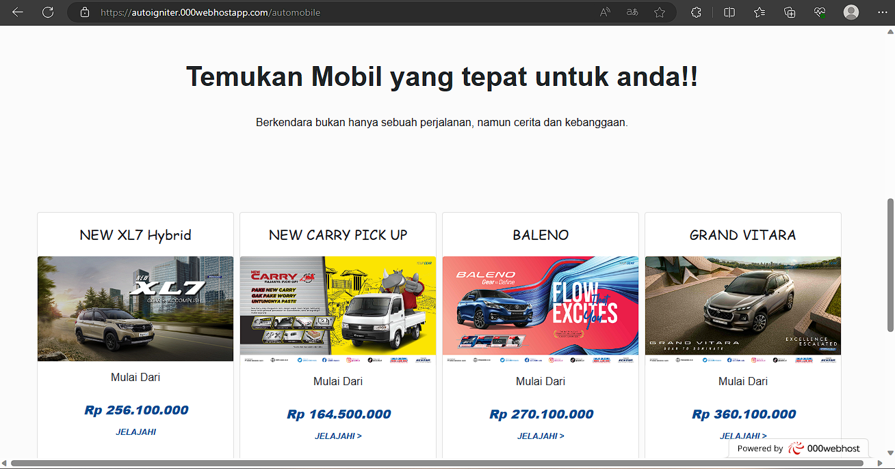

<div align="center">
  <a href="https://autoigniter.000webhostapp.com/" target="_blank">
    
  </a>
  <h2 style="font-size:30px;" align="center"><strong>Showroom Kendaraan</strong></h2>
 

</div>

<br/>

```
Tugas           : Project Akhir Pemograman Web 2

Judul Project   : Database Penjualan Kendaraan

Kelas           : TI.21.A2

Mata Kuliah     : Pemograman Web 2

Dosen           : Agung Nugroho,S.Kom.,M.Kom

Kelompok 1      : • 312110103 / RAVANSA RAHMAN SANTOSA- Membuat Database dan Templat Halaman Utama
                  • 312110177 / MUHAMMAD KHRISNA FAISAL ZUHRI- Membuat Halaman Motorcylce
                  • 312110151 / RIZAL PRINGGANDANI - Membuat Halaman Automobile
                  • 312110172 / MUFIDA NURIYANA - Membuat Halaman Detail Mobil
                  • 312110181 / HAMIM MUHANA AYDIN NASHIF - Membuat Halaman Detail Motor
                 
```
<br/>

## About App

Aplikasi Penjualan Kendaraan adalah sebuah platform web penjualan dan promosi kendaraan. Aplikasi ini menyediakan berbagai fitur yang memungkinkan pengguna untuk melakukan pemesanan,melihat detail motor dan mobil agar pembeli tertarik untuk membeli produk

Halaman Web dan fitur:

Home: <br> berisi tentang profile Showroom dan pengenalan produk.

Motorcycle: <br>di halaman ini berisi berbagai pilihan motor yang dapat di pesan oleh penbeli ,pilih salah satu motor yang ada pada pilihan lalu klik jelajahi untuk melihat detail yang lebih spesifik dari motor yang di pilih.

Automobile: <br>di halaman ini berisi berbagai pilihan mobil yang dapat di pesan oleh penbeli ,pilih salah satu mobil yang ada pada pilihan lalu klik jelajahi untuk melihat detail yang lebih spesifik dari mobil yang di pilih.


fitur book now: <br>pada setiap halaaman detail motor dan mobil terdapat fitur book now untuk memesan kendaran ,pembeli akan di minta memasukan nama,nomor,alamat

<br/>

## Tech Stack
- PHP
- CI 4
- MySql
- JavaScript
- CSS


<br/>

## Features

- Home
- Motorcyle
- Automobile
- Contacts
- Book Now
- Detail

<br/>

## Halaman Home
  
<br/>

## Halaman Motorcyle
  

<br/>

## Halaman Automobile
 

<br/>

## Halaman Contacts
 

<br/>

## Book Now
 

<br/>

## Database
 

<br/>
  
## Links

- Web : https://autoigniter.000webhostapp.com/
- Repo : https://github.com/ravansaa/showroom-project-ci4.git
